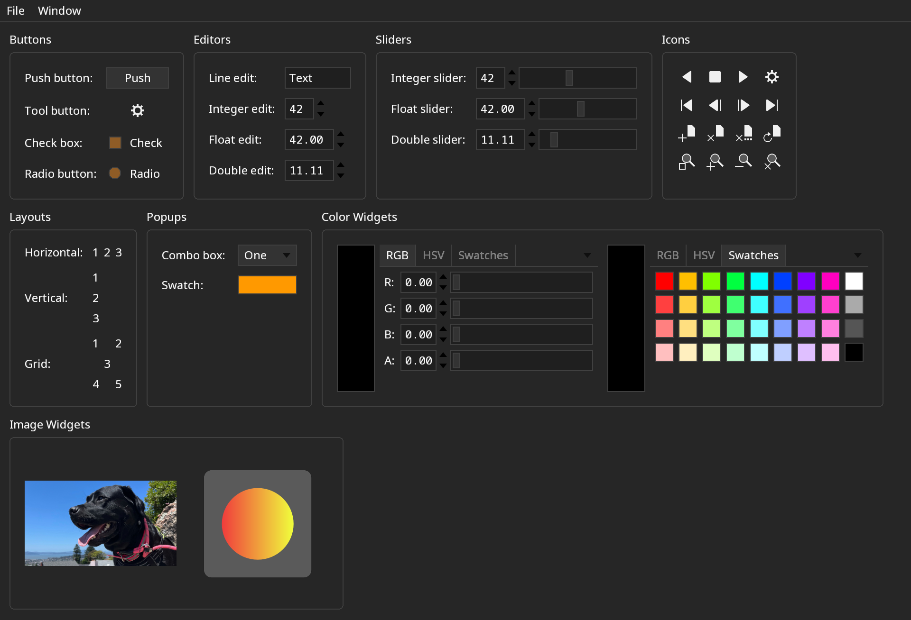
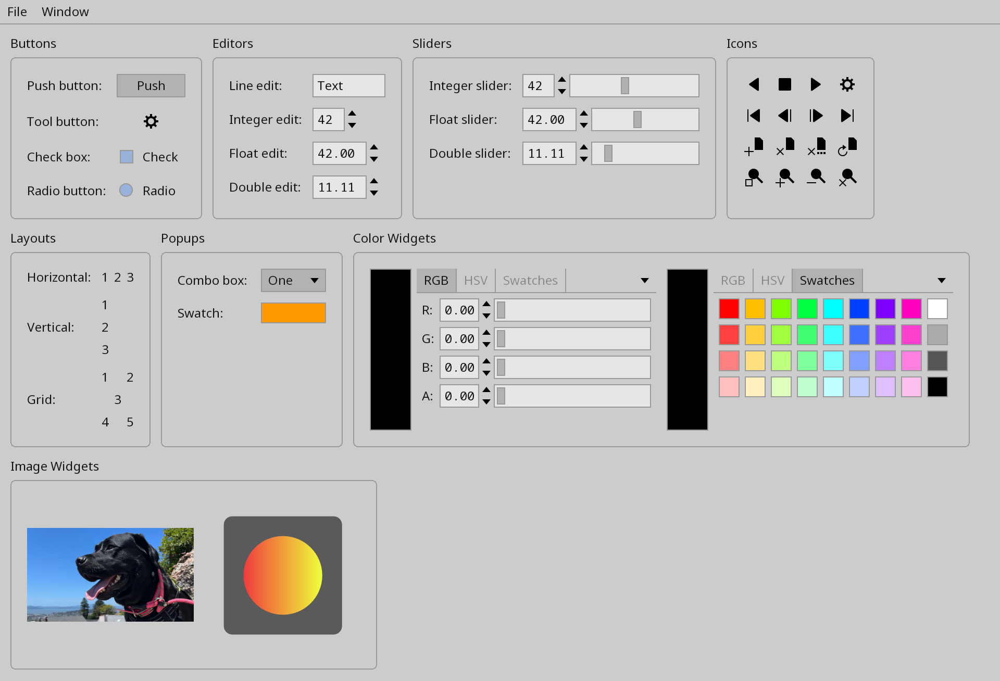

[](https://opensource.org/licenses/BSD-3-Clause)
[](https://github.com/darbyjohnston/feather-tk/actions/workflows/ci-workflow.yml)
[](https://codecov.io/gh/darbyjohnston/feather-tk)

# feather-tk

A lightweight toolkit for building cross-platform applications.

Features:
* Available for Linux, macOS, and Windows
* Collection of widgets including buttons, editors, sliders, and menus
* Collection of layouts including horizontal, vertical, grid, and tabs
* Keyboard navigation
* Command-line parsing
* Written in C++17 with a CMake build system
* Entire project and dependencies can be built in a few minutes
* Statically linked demo binaries are under 10MB
* BSD open source license

Work in progress:
* Multiple line text editor widget
* Python bindings

Projects using feather-tk:
* https://github.com/darbyjohnston/DJV
* https://github.com/darbyjohnston/tlRender
* https://github.com/OpenTimelineIO/toucan

Demo example with dark color style:



Demo example with light color style:



Simple C++ example that shows a window with a text label:
```
#include <feather-tk/ui/App.h>
#include <feather-tk/ui/Label.h>
#include <feather-tk/ui/MainWindow.h>

using namespace feather-tk;

int main(int argc, char** argv)
{
    // Create the context and application.
    auto context = Context::create();
    auto app = App::create(context, argc, argv, "simple", "Simple example");
    if (app->getExit() != 0)
        return app->getExit();

    // Create a window.
    auto window = MainWindow::create(context, app, "simple", Size2I(1280, 960));

    // Create a label.
    auto label = Label::create(context, "Hello world");
    label->setFontRole(FontRole::Title);
    label->setAlign(HAlign::Center, VAlign::Center);
    label->setStretch(Stretch::Expanding);
    window->setWidget(label);

    // Show the window and run the application.
    window->show();
    app->run();
    return 0;
}
```

Simple Python exmple that shows a window with a text label:
```
import feather-tk as ftk
import sys

# Create the context and application.
context = ftk.Context()
app = ftk.App(context, sys.argv, "simple", "Simple example")
if app.getExit() != 0:
    sys.exit(app.getExit())

# Create a window.
window = ftk.MainWindow(context, app, "simple", ftk.Size2I(1280, 960))

# Create a label.
label = ftk.Label(context, "Hello world")
label.fontRole = ftk.FontRole.Title
label.setAlign(ftk.HAlign.Center, ftk.VAlign.Center);
label.setStretch(ftk.Stretch.Expanding);
window.setWidget(label)

# Show the window and run the application.
window.show()
app.run()

# \bug Need to manually reset the window.
window = None

```


## Building Dependencies

A CMake super build script is provided to build all of the dependencies from
source.

Required dependencies:
* [Freetype](https://freetype.org/)
* [GLFW](https://www.glfw.org/)
* [LunaSVG](https://github.com/sammycage/lunasvg)
* [Native File Dialog Extended](https://github.com/btzy/nativefiledialog-extended)
* [nlohmann JSON](https://github.com/nlohmann/json)
* [PNG](http://www.libpng.org/pub/png/libpng.html)
* [ZLIB](https://zlib.net/)

Optional dependencies:
* [pybind11](https://github.com/pybind/pybind11)


## Building on Linux

Clone the repository:
```
git clone https://github.com/darbyjohnston/feather-tk.git
```
Run CMake:
```
cmake -S feather-tk/etc/SuperBuild -B Release -DCMAKE_INSTALL_PREFIX=$PWD/Release/install -DCMAKE_PREFIX_PATH=$PWD/Release/install -DCMAKE_BUILD_TYPE=Release
```
Start the build:
```
cmake --build Release -j 4 --config Release
```
Try running the `simple` example:
```
Release/feather-tk/src/feather-tk-build/examples/simple/simple
```
For debug builds:
```
cmake -S feather-tk/etc/SuperBuild -B Debug -DCMAKE_INSTALL_PREFIX=$PWD/Debug/install -DCMAKE_PREFIX_PATH=$PWD/Debug/install -DCMAKE_BUILD_TYPE=Debug
```
```
cmake --build Debug -j 4 --config Debug
```


## Building on macOS

Clone the repository:
```
git clone https://github.com/darbyjohnston/feather-tk.git
```
Run CMake:
```
cmake -S feather-tk/etc/SuperBuild -B Release -DCMAKE_INSTALL_PREFIX=$PWD/Release/install -DCMAKE_PREFIX_PATH=$PWD/Release/install -DCMAKE_BUILD_TYPE=Release
```
Start the build:
```
cmake --build Release -j 4 --config Release
```
Try running the `simple` example:
```
Release/feather-tk/src/feather-tk-build/examples/simple/simple
```
For debug builds:
```
cmake -S feather-tk/etc/SuperBuild -B Debug -DCMAKE_INSTALL_PREFIX=$PWD/Debug/install -DCMAKE_PREFIX_PATH=$PWD/Debug/install -DCMAKE_BUILD_TYPE=Debug
```
```
cmake --build Debug -j 4 --config Debug
```

The CMake variable "CMAKE_OSX_ARCHITECTURES" can be used to specify the build
architecture:
```
-DCMAKE_OSX_ARCHITECTURES=x86_64
```
```
-DCMAKE_OSX_ARCHITECTURES=arm64
```

These aliases are convenient for switching between architectures:
```
alias arm="env /usr/bin/arch -arm64 /bin/zsh --login"
alias intel="env /usr/bin/arch -x86_64 /bin/zsh --login"
```


## Building on Windows

Clone the repository:
```
git clone https://github.com/darbyjohnston/feather-tk.git
```
Run CMake:
```
cmake -S feather-tk\etc\SuperBuild -B Release -DCMAKE_INSTALL_PREFIX=%CD%\Release\install -DCMAKE_PREFIX_PATH=%CD%\Release\install -DCMAKE_BUILD_TYPE=Release
```
Start the build:
```
cmake --build Release -j 4 --config Release
```
Try running the `simple` example:
```
Release\feather-tk\src\feather-tk-build\examples\simple\Release\simple
```
For debug builds:
```
cmake -S feather-tk\etc\SuperBuild -B Debug -DCMAKE_INSTALL_PREFIX=%CD%\Debug\install -DCMAKE_PREFIX_PATH=%CD%\Debug\install -DCMAKE_BUILD_TYPE=Debug
```
```
cmake --build Debug -j 4 --config Debug
```

